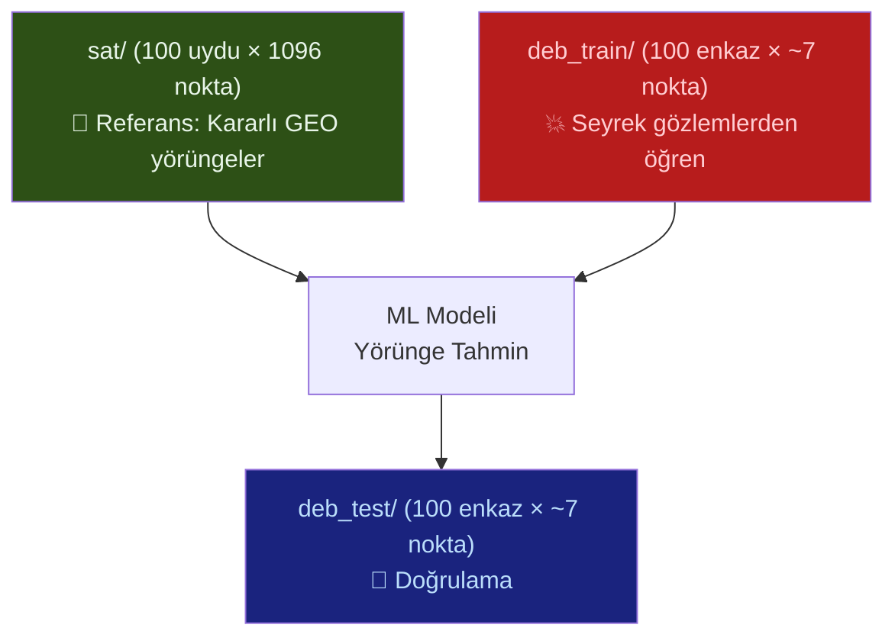

# 📊 Veri Analiz Çıktıları — Detaylı Yorum

## 1. Oluşturulan CSV Dosyaları

| Dosya | Satır | Boyut | İçerik |
|-------|-------|-------|--------|
| `sat_combined.csv` | 109,600 | ~10 MB | 100 uydu × 1,096 gözlem |
| `deb_train_combined.csv` | 751 | ~72 KB | 100 enkaz — eğitim seti |
| `deb_test_combined.csv` | 751 | ~72 KB | 100 enkaz — test seti |
| `turkish_satellites.csv` | 11 | ~1.5 KB | Türk uyduları listesi |

CSV sütunları: `Dosya Adı, time_days, semi_major_axis_km, eccentricity, inclination_deg, raan_deg, arg_perigee_deg, mean_anomaly_deg`

---

## 2. Analiz Çıktılarının Yorumu

### 🛰️ Uydu Verileri (sat/) — Kararlı Referans Yörüngeler

```
Yarı Büyük Eksen a : 42,244 – 42,265 km  (std = 3.86 km)
Eksantrisite e      : 0.003 – 0.111       (ort = 0.053)
Eğim i              : 0.09° – 24.5°       (ort = 11.6°)
Zaman aralığı       : -7,305 – +3,645 gün (~30 yıl)
```

> [!IMPORTANT]
> **Yorum:** Bu 100 uydu, **GEO (Jeosenkron) yörüngededir.** Yarı büyük eksenin ~42,250 km ve periyodun ~24.01 saat olması bunu doğruluyor. Bunlar haberleşme uyduları gibi görünüyor ve yörüngeleri son derece **kararlı ve öngörülebilir**:
> - Yarı büyük eksen sadece ±10 km salınıyor
> - Eksantrisite düşük (çoğu <0.1 → neredeyse dairesel)
> - Eğim dağılımı: %87'si 5°-30° arasında → ekvator yakınına yerleştirilmiş
> - Her uydu için 10 günde bir ölçüm → çok düzenli zaman serisi

### 💥 Enkaz Eğitim Verileri (deb_train/)

```
Yarı Büyük Eksen a : 41,799 – 42,360 km  (std = 63.7 km)
Eksantrisite e      : 0.002 – 0.835       (ort = 0.160)
Eğim i              : 0.37° – 44.6°       (ort = 16.0°)
Zaman aralığı       : düzensiz, 1-15 gözlem/enkaz
```

> [!WARNING]
> **Yorum:** Enkaz verilerinin uydu verilerinden **radikal farkları** var:
> 
> 1. **Yarı büyük eksende büyük sapma:** ±560 km aralığında (uydu: ±20 km). Enkazın yörüngesi "sürükleniyor."
> 2. **Eksantrisite çok yüksek:** %8.5'i e ≥ 0.5 (yüksek eliptik), %7.6'sı 0.3-0.5 arası. Bu, enkazın çok uzun ve ince eliptik yörüngelerde olduğunu gösterir — Dünya'ya çok yaklaşıp çok uzaklaşıyor.
> 3. **Eğim yayılımı geniş:** 0°'den 44°'ye kadar → enkaz her yöne saçılmış durumda.
> 4. **Veri çok seyrek:** Dosya başına ortalama 7.5 gözlem, düzensiz aralıklı.

### 🧪 Enkaz Test Verileri (deb_test/)

```
Yarı Büyük Eksen a : 39,048 – 42,362 km  (std = 274.6 km)
Eksantrisite e      : 0.001 – 0.874       (ort = 0.166)
Eğim i              : 0.59° – 54.5°       (ort = 17.1°)
```

> [!CAUTION]
> **Yorum:** Test setindeki enkaz daha da **kaotik** davranıyor:
> - Yarı büyük eksen **39,048 km'ye** kadar düşüyor → bazı enkaz parçaları yörüngeden kayıyor (yeniden giriş riski!)
> - Standart sapma 274.6 km (eğitimde 63.7 km) → 4 kat daha fazla belirsizlik
> - Eksantrisite 0.87'ye ulaşıyor → neredeyse parabolik yörünge
> - Eğim 54°'ye kadar çıkıyor → eğitim setinden daha aşırı

---

## 3. Karşılaştırmalı Tablo — Kritik Farklar

| Parametre | Uydu (sat) | Enkaz (train) | Enkaz (test) | Yorum |
|-----------|-----------|-------------|-------------|-------|
| **a (km)** | 42,255 ±4 | 42,249 ±64 | 42,218 ±275 | Enkaz yörüngesi sürükleniyor |
| **e** | 0.053 ±0.03 | 0.160 ±0.18 | 0.166 ±0.19 | Enkaz 3× daha eliptik |
| **i (°)** | 11.6 ±5.2 | 16.0 ±7.5 | 17.1 ±7.8 | Enkaz daha geniş yayılıyor |
| **Periapsis irt.** | 33,644 km | 29,106 km | 28,830 km | Enkaz Dünya'ya 4,500 km daha yaklaşıyor |
| **Apoapsis irt.** | 38,124 km | 42,650 km | 42,864 km | Enkaz daha yükseğe çıkıyor |

---

## 4. Fiziksel Yorumlar

### Neden Uydu Yörüngeleri Kararlı?
Jeosenkron uydular istasyon tutma (station-keeping) manevrası yapar — küçük itici motorlarla yörüngelerini düzelterek hep aynı noktada kalırlar. Bu yüzden:
- Eksantrisite düşük ve stabil kalıyor
- Yarı büyük eksen neredeyse sabit

### Neden Enkaz Yörüngeleri Kaotik?
Uzay enkazının **motoru yoktur**. Dolayısıyla:
- **Güneş/Ay çekim pertürbasyon**ları yörüngeyi yavaş yavaş bozar
- **Güneş radyasyon basıncı** (Solar Radiation Pressure - SRP) küçük parçalarda büyük etki yapar
- **Yüksek eksantrisite** → Dünya'nın J2 pertürbasyonundan çok etkilenir
- Sonuç: Zaman geçtikçe yörünge parametreleri hızla values

### Anomali: Bazı Enkaz Verilerinde 360° < M < 366°

> [!NOTE]
> Bazı enkaz dosyalarında ortalama anomali (M) değeri **360°'yi aşıyor** (örn: 362.38°, 365.53°, 366.16°). Bu, modüler aritmetik uygulanmadan kaydedilmiş veri anlamına gelir. Fiziksel olarak `M % 360` alınmalıdır, ancak model eğitiminde bu "ham" değerlerin bilerek bırakılmış olma ihtimali var — modelin bu periodisite'yi öğrenmesi beklenebilir.

---

## 5. Makine Öğrenmesi Perspektifi

### Problemin Tanımı
**Girdi:** Bir uzay parçasının seyrek, düzensiz aralıklı yörünge gözlemleri (1-15 veri noktası)
**Çıktı:** Gelecekteki yörünge parametrelerinin tahmini

### Neden Zor?
1. **Seyreklik:** Uydu başına 1096 ölçüm var ama enkaz başına sadece 1-15
2. **Düzensiz zamanlama:** Gözlemler eşit aralıklı değil
3. **Yüksek değişkenlik:** Eksantrisite 0.001'den 0.87'ye, eğim 0°'den 55°'ye kadar değişiyor
4. **Doğrusal olmayan dinamik:** Yörünge pertürbasyonları karmaşık ve kaotik

### Veri Setinin Tasarım Mantığı



### Sat Verilerinin Rolü
`sat/` klasörü muhtemelen **pre-training** veya **referans modeli** oluşturmak için kullanılacak. 1096 veri noktalı düzenli zaman serileri, yörünge mekaniğinin genel kurallarını modele öğretmek için idealdir.

---

## 6. Öneriler

1. **Veri Ön İşleme:** Anomali değerleri (M > 360°) normalize edin, `M = M % 360`
2. **Özellik Mühendisliği:** Türetilmiş parametreler (periapsis/apoapsis irtifası, periyot) ekleyin
3. **Zaman Kodlama:** Düzensiz zaman aralıklarını ele almak için pozisyonel encoding veya delta-t özellikleri kullanın
4. **Transfer Learning:** Önce sat/ verisiyle pre-train, sonra deb_train/ ile fine-tune
5. **Değerlendirme Metriği:** Her yörünge elemanı için ayrı RMSE hesaplayın — eksantrisite ve eğim en kritik parametreler
